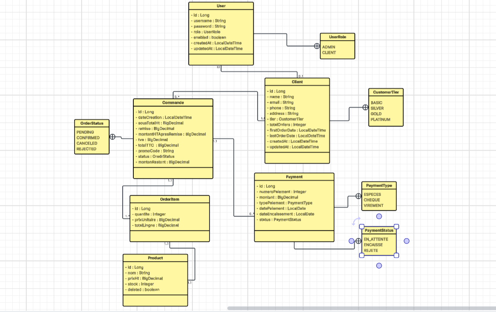
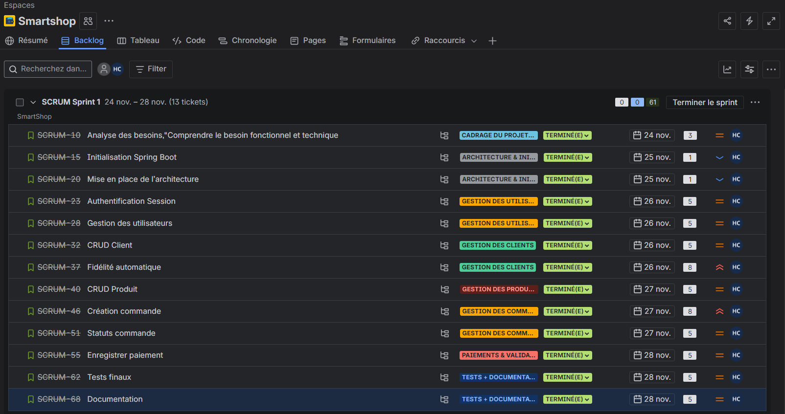
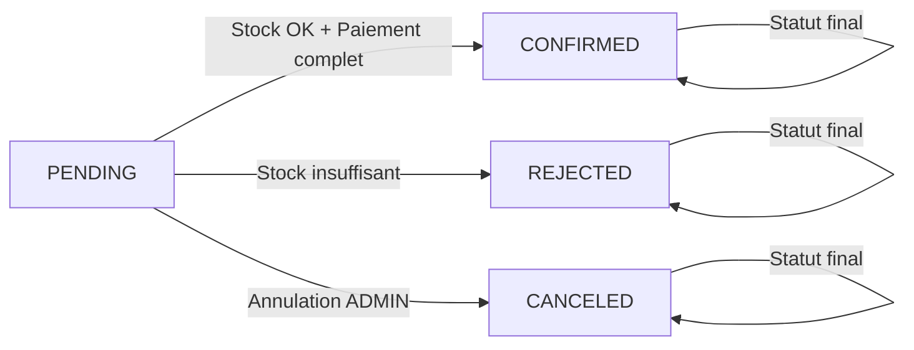

# 🛒 SmartShop - Système de Gestion Commerciale B2B

## 📋 Description du Projet

**SmartShop** est une application web backend REST de gestion commerciale destinée à **MicroTech Maroc**, distributeur B2B de matériel informatique basé à Casablanca. L'application permet de gérer un portefeuille de 650 clients actifs avec un système de fidélité à remises progressives et des paiements fractionnés multi-moyens par facture.

### 🎯 Objectifs Principaux
- Gestion complète des clients et produits
- Système de fidélité automatique avec 4 niveaux (BASIC, SILVER, GOLD, PLATINUM)
- Gestion des commandes multi-produits avec calculs automatiques (remises, TVA, totaux)
- Paiements fractionnés multi-moyens (Espèces, Chèque, Virement)
- Traçabilité complète des événements financiers
- Optimisation de la gestion de la trésorerie

---

## 🏗️ Architecture du Projet

### Stack Technique
- **Framework**: Spring Boot 3.x
- **Langage**: Java 17
- **Build Tool**: Maven
- **Base de données**: MySQL 8.x
- **ORM**: Spring Data JPA / Hibernate
- **Validation**: Jakarta Validation
- **Mapping**: MapStruct
- **Documentation API**: Swagger/OpenAPI (springdoc-openapi)
- **Tests**: JUnit 5, Mockito
- **Utilitaires**: Lombok, BCrypt

### Architecture en Couches
```
src/main/java/com/microtech/smartshop/
├── controller/          # Couche REST API
├── service/            # Logique métier
├── repository/         # Accès aux données
├── entity/             # Entités JPA
├── dto/                # Data Transfer Objects
│   ├── request/        # DTOs pour requêtes
│   └── response/       # DTOs pour réponses
├── mapper/             # MapStruct mappers
├── enums/              # Énumérations
├── exception/          # Gestion des exceptions
└── config/             # Configuration et sécurité
```

---

## 📊 Diagramme de Classes UML

<!-- TODO: Ajouter le diagramme de classes UML ici -->



---

## 📅 Planification JIRA

<!-- TODO: Ajouter la capture d'écran de la planification JIRA ici -->



---

## 🚀 Installation et Configuration

### Prérequis
- Java 17 ou supérieur
- Maven 3.8+
- MySQL 8.0+
- Git

### Étapes d'Installation

1. **Cloner le projet**
```bash
git clone https://github.com/HamzaChehlaoui/SmartShop
cd SmartShop
```

2. **Configurer la base de données**

Créer une base de données MySQL :
```sql
CREATE DATABASE smartshop;
```

Modifier le fichier `src/main/resources/application.properties` :
```properties
spring.datasource.url=jdbc:mysql://localhost:3306/smartshop?useSSL=false&serverTimezone=UTC
spring.datasource.username=root
spring.datasource.password=votre_mot_de_passe
```

3. **Compiler le projet**
```bash
mvn clean install
```

4. **Lancer l'application**
```bash
mvn spring-boot:run
```

L'application sera accessible sur : `http://localhost:8081`

---

## 📚 Documentation API

### Swagger UI
Une fois l'application lancée, accédez à la documentation interactive Swagger :

🔗 **http://localhost:8081/swagger-ui/index.html**

### Authentification

L'application utilise des **Sessions HTTP** (pas de JWT, pas de Spring Security).

**Endpoint de connexion** :
```http
POST /api/auth/login
Content-Type: application/json

{
  "username": "admin",
  "password": "password"
}
```

**Endpoint de déconnexion** :
```http
POST /api/auth/logout
```

---

## 👥 Gestion des Rôles

### Matrice de Permissions

| Fonctionnalité | ADMIN | CLIENT |
|----------------|-------|--------|
| Créer/Modifier/Supprimer Clients | ✅ | ❌ |
| Voir tous les clients | ✅ | ❌ |
| Voir son propre profil | ✅ | ✅ |
| Créer/Modifier/Supprimer Produits | ✅ | ❌ |
| Voir liste produits | ✅ | ✅ (lecture seule) |
| Créer commandes | ✅ | ❌ |
| Voir toutes les commandes | ✅ | ❌ |
| Voir ses propres commandes | ✅ | ✅ |
| Valider/Annuler commandes | ✅ | ❌ |
| Enregistrer paiements | ✅ | ❌ |
| Voir historique | ✅ | ✅ (propre historique) |

---

## 💎 Système de Fidélité

### Niveaux et Conditions

| Niveau | Conditions d'obtention | Remise applicable |
|--------|------------------------|-------------------|
| **BASIC** | Par défaut (0 commande) | Aucune remise |
| **SILVER** | ≥ 3 commandes OU ≥ 1,000 DH cumulés | 5% si sous-total ≥ 500 DH |
| **GOLD** | ≥ 10 commandes OU ≥ 5,000 DH cumulés | 10% si sous-total ≥ 800 DH |
| **PLATINUM** | ≥ 20 commandes OU ≥ 15,000 DH cumulés | 15% si sous-total ≥ 1,200 DH |

### Fonctionnement

1. **Acquisition du niveau** : Calculé automatiquement après chaque commande **CONFIRMÉE**
2. **Utilisation du niveau** : Les remises s'appliquent sur les **futures commandes**
3. **Cumul des remises** : Remise fidélité + Code promo (PROMO-XXXX = +5%)

### Exemple Pratique

```
Client Ahmed s'inscrit → Niveau BASIC

Commande 1 : 250 DH → Confirmée → 1 commande, 250 DH → Reste BASIC
Commande 2 : 350 DH → Confirmée → 2 commandes, 600 DH → Reste BASIC  
Commande 3 : 450 DH → Confirmée → 3 commandes, 1050 DH → DEVIENT SILVER

Commande 4 : 600 DH → Remise 5% = -30 DH → Total : 570 DH (niveau SILVER actif)
```

---

## 💳 Système de Paiements

### Moyens de Paiement Acceptés

| Type | Limite | Statuts | Champs requis |
|------|--------|---------|---------------|
| **ESPÈCES** | Max 20,000 DH (légal) | ENCAISSE | `referenceRecu`, `datePaiement` |
| **CHÈQUE** | Aucune | EN_ATTENTE, ENCAISSE, REJETE | `numeroCheque`, `banqueCheque`, `dateEcheance` |
| **VIREMENT** | Aucune | EN_ATTENTE, ENCAISSE, REJETE | `referenceVirement`, `banqueVirement` |

### Paiement Fractionné

Une commande peut être payée en **plusieurs fois** avec **différents moyens**.

**Règle critique** : Une commande doit être **totalement payée** (`montantRestant = 0`) avant validation (statut CONFIRMED).

**Exemple** :
```
Commande de 10,000 DH

Paiement 1 : 6,000 DH ESPÈCES → Restant : 4,000 DH
Paiement 2 : 3,000 DH CHÈQUE (EN_ATTENTE) → Restant : 4,000 DH (non encaissé)
Paiement 3 : 1,000 DH VIREMENT → Restant : 1,000 DH

Admin encaisse le chèque → Restant : 0 DH
→ Commande peut maintenant être CONFIRMÉE
```

---

## 🧮 Calculs Automatiques

### Formule de Calcul d'une Commande

```
1. Sous-total HT = Σ (Prix HT × Quantité)
2. Remise = Remise Fidélité + Remise Code Promo
3. Montant HT après remise = Sous-total HT - Remise
4. TVA (20%) = Montant HT après remise × 0.20
5. Total TTC = Montant HT après remise + TVA
```

**Exemple** :
```
Sous-total : 1,000 DH
Remise : 100 DH (10% GOLD)
Montant HT après remise : 900 DH
TVA 20% : 180 DH
Total TTC : 1,080 DH
```

---

## 🎟️ Système de Codes Promotionnels

### Fonctionnalités

Le système de codes promo offre une gestion avancée avec :
- **Validation du format strict** : `PROMO-[A-Z0-9]{4}`
- **Usage unique par client** : Un client ne peut utiliser le même code qu'une fois
- **Périodes de validité** : Dates de début et fin configurables
- **Pourcentages variables** : Différents taux de remise (5%, 10%, 15%, etc.)
- **Limites d'utilisation globale** : Nombre maximum d'utilisations par code
- **Activation/désactivation** : Contrôle du statut actif

### Codes Promo Disponibles (DataSeeder)

| Code | Remise | Statut | Validité | Usage Max | Description |
|------|--------|--------|----------|-----------|-------------|
| `PROMO-2025` | 5% | ✅ Active | 1 an | Illimité | Code général pour 2025 |
| `PROMO-VIP1` | 10% | ✅ Active | 90 jours | 100 | Code VIP limité |
| `PROMO-TEST` | 5% | ❌ Inactive | 60 jours | - | Code de test (désactivé) |
| `PROMO-OLD1` | 15% | ⏰ Expiré | Passé | - | Code expiré pour tests |

### Validations Automatiques

Lors de l'application d'un code promo, le système vérifie :
1. ✅ Format valide (`PROMO-[A-Z0-9]{4}`)
2. ✅ Existence en base de données
3. ✅ Statut actif (`isActive = true`)
4. ✅ Période de validité (`validFrom` ≤ maintenant ≤ `validUntil`)
5. ✅ Non utilisé par ce client (usage unique)
6. ✅ Limite globale non atteinte

### Exemple d'Utilisation

**Scénario** : Client GOLD avec commande de 1,000 DH + code `PROMO-2025`

```
Sous-total HT : 1,000 DH
Remise fidélité GOLD (10%) : -100 DH
Remise code promo (5%) : -50 DH
─────────────────────────────────
Total remises : -150 DH
Montant HT après remise : 850 DH
TVA 20% : 170 DH
Total TTC : 1,020 DH
```

### Messages d'Erreur

| Erreur | Message |
|--------|---------|
| Format invalide | "Format du code promo invalide. Format attendu: PROMO-XXXX" |
| Code inexistant | "Code promo 'PROMO-XXXX' invalide ou inactif" |
| Pas encore valide | "Le code promo 'PROMO-XXXX' n'est pas encore valide" |
| Expiré | "Le code promo 'PROMO-XXXX' a expiré" |
| Déjà utilisé | "Vous avez déjà utilisé le code promo 'PROMO-XXXX'" |
| Limite atteinte | "Le code promo 'PROMO-XXXX' a atteint sa limite d'utilisation" |

---

## 🔄 Cycle de Vie d'une Commande

### Statuts et Transitions



**Statuts** :
- `PENDING` : En attente de validation
- `CONFIRMED` : Validée par ADMIN (stock déduit, stats client mises à jour)
- `CANCELED` : Annulée manuellement par ADMIN
- `REJECTED` : Refusée (stock insuffisant)

---

## 🧪 Tests Unitaires

Le projet inclut des **tests unitaires** avec JUnit 5 et Mockito :

```bash
mvn test
```

**Couverture** :
- ✅ `ClientServiceTest` (2 tests)
- ✅ `CommandeServiceTest` (2 tests)
- ✅ `PaymentServiceTest` (2 tests)

**Résultats** : 6/6 tests passés ✅

---

## 📦 Modèle de Données

### Entités Principales

- **User** : Utilisateurs du système (ADMIN/CLIENT)
- **Client** : Clients B2B avec niveau de fidélité
- **Product** : Produits informatiques avec stock
- **Commande** : Commandes multi-produits
- **OrderItem** : Lignes de commande (produit + quantité)
- **Payment** : Paiements multi-moyens avec numérotation séquentielle
- **PromoCode** : Codes promotionnels avec gestion des périodes de validité et limites d'utilisation
- **PromoCodeUsage** : Historique d'utilisation des codes promo (tracking usage unique)

### Énumérations

- `UserRole` : ADMIN, CLIENT
- `CustomerTier` : BASIC, SILVER, GOLD, PLATINUM
- `OrderStatus` : PENDING, CONFIRMED, CANCELED, REJECTED
- `PaymentStatus` : EN_ATTENTE, ENCAISSE, REJETE
- `PaymentType` : ESPECES, CHEQUE, VIREMENT

---

## ⚠️ Règles Métier Critiques

1. **Validation stock** : `quantité_demandée ≤ stock_disponible`
2. **Arrondis** : Tous les montants à **2 décimales**
3. **Codes promo** : Format strict `PROMO-[A-Z0-9]{4}`, usage unique par client, gestion en base de données avec périodes de validité
4. **TVA** : 20% par défaut (configurable via `app.tva.rate`)
5. **Limite espèces** : Maximum **20,000 DH** par paiement (légal au Maroc)
6. **Validation commande** : Impossible si `montantRestant > 0`
7. **Soft delete** : Produits utilisés dans commandes marqués `deleted=true`

---

## 🛡️ Gestion des Exceptions

### Codes HTTP

| Code | Signification | Exemple |
|------|---------------|---------|
| 400 | Bad Request | Données invalides |
| 401 | Unauthorized | Non authentifié |
| 403 | Forbidden | Accès refusé (RBAC) |
| 404 | Not Found | Ressource inexistante |
| 422 | Unprocessable Entity | Règle métier violée |
| 500 | Internal Server Error | Erreur serveur |

### Format de Réponse

```json
{
  "timestamp": "2025-11-29T19:00:00",
  "status": 422,
  "error": "Business Rule Violation",
  "message": "Stock insuffisant pour le produit Laptop HP. Disponible: 50, Demandé: 100",
  "path": "/api/commandes"
}
```

---

## 📂 Structure du Projet

```
SmartShop/
├── src/
│   ├── main/
│   │   ├── java/com/microtech/smartshop/
│   │   │   ├── controller/
│   │   │   ├── service/
│   │   │   ├── repository/
│   │   │   ├── entity/
│   │   │   ├── dto/
│   │   │   ├── mapper/
│   │   │   ├── enums/
│   │   │   ├── exception/
│   │   │   └── config/
│   │   └── resources/
│   │       └── application.properties
│   └── test/
│       └── java/com/microtech/smartshop/
│           └── service/
├── docs/
│   └── class-diagram.png
├── pom.xml
└── README.md
```

---

## 👨‍💻 Auteur

**Nom** : Hamza Chehlaoui  
**Formation** : Développement Digital - Youcode  
**Date** : Novembre 2025  
**Projet** : Brief SmartShop - Système de Gestion Commerciale B2B

---

## 📄 Licence

Ce projet est développé dans un cadre pédagogique pour **Youcode**.

---


---


